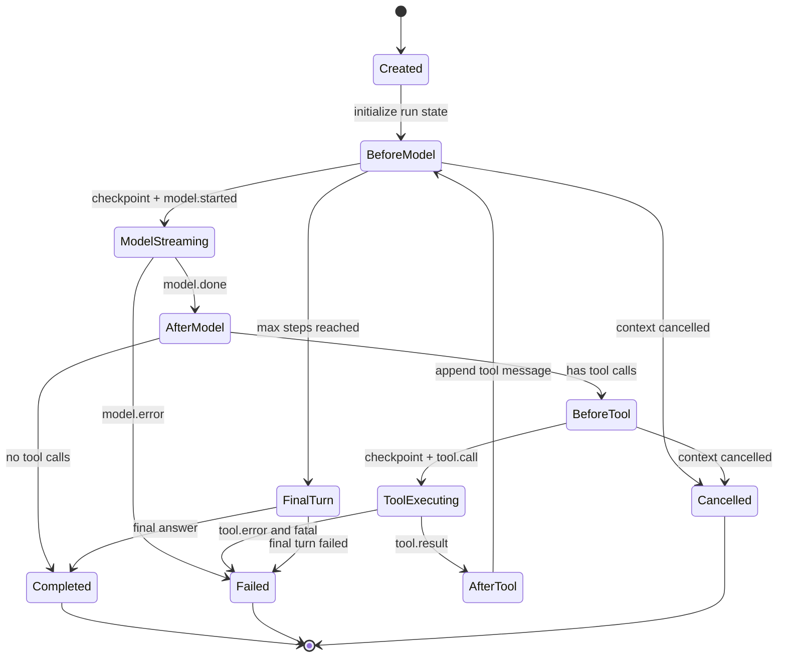
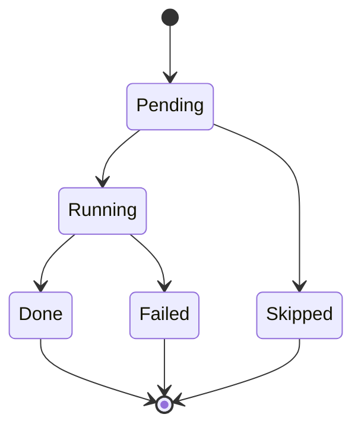

# Harness State Machine

This document describes the minimal S4 runtime state machine.

## Main Loop

## Checkpoint Boundaries

Checkpoint before:

- model call;
- tool execution;
- final turn;
- terminal event.

Checkpoint after:

- model turn;
- tool result message injection;
- final answer;
- approval decision in later stages.

## Resume Map

| Phase | Resume Action |
| --- | --- |
| `created` | start from first model call |
| `model` before request | call model |
| `model` after response with tools | execute pending tools |
| `tool` before execution | execute active/pending tool |
| `tool` after result | continue next model turn |
| `approval` | wait through approval broker once S6 exists |
| `finalizing` | run final no-tool turn |
| `completed` | return stored result |
| `failed` | return stored error |
| `cancelled` | return cancelled state |

## Tool Call State

## Notes

- S4 does not support resuming a provider stream mid-token.
- S4 does not support resuming an OS process mid-command.
- The retry behavior for tools belongs to S2 middleware.
- Approval pause belongs to S6, but S4 state must be able to represent it.

